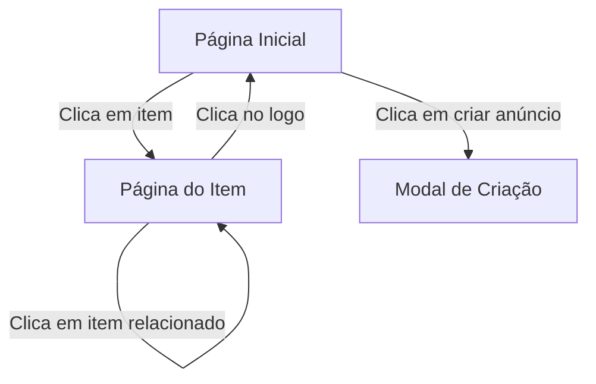

# Donare - Plataforma de Doação de Itens

Plataforma web que conecta pessoas que querem doar itens usados com quem precisa deles, promovendo a economia circular e o consumo consciente.

## ✨ Funcionalidades Principais

- **Catálogo de itens** disponíveis para doação
- **Sistema de anúncios** para doadores
- **Busca inteligente** por categorias

## 🛠 Tecnologias Utilizadas

### Frontend
- HTML5 
- CSS3 
- JavaScript
- [Font Awesome](https://fontawesome.com/) para ícones
- Google Fonts (Poppins e Bebas Neue)

### Backend (Sugerido para implementação futura)
- Node.js com Express
- Banco de dados MongoDB
- Autenticação JWT

## 📂 Estrutura de Arquivos

```
donare/
├── public/
│   ├── assets/           
│   │    └── Image.png            
│   ├── scripts/          
│   │    ├── faqExpansao.js
│   │    ├── modalAnuncio.js     
│   │    └── modalLogin.js      
│   ├── styles/           
│   │    ├── home.css
│   │    ├── landing.css      
│   │    └── item.css      
│   ├── index.html        
│   ├── item.html
│   ├── home.html
├── vercel.json   
└── README.md        
```

## 🎨 Componentes Principais

### Header/Navbar
- Logo com link para home
- Ícone de perfil
- Botão "Criar Anúncio"

### Página Inicial
- Listagem de itens disponíveis
- Filtro por categorias
- Cards com:
  - Imagem do item
  - Título
  - Categoria
  - Data de publicação
  - Descrição resumida

### Página de Item
- Galeria de imagens com thumbnails
- Informações detalhadas:
  - Título completo
  - Descrição detalhada
  - Características
- Seção do doador:
  - Foto e nome
  - Botões de contato
- Itens relacionados

## 🔄 Fluxo de Navegação



